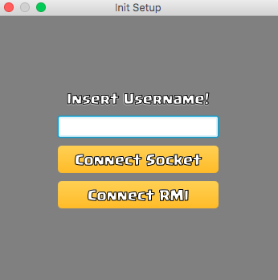
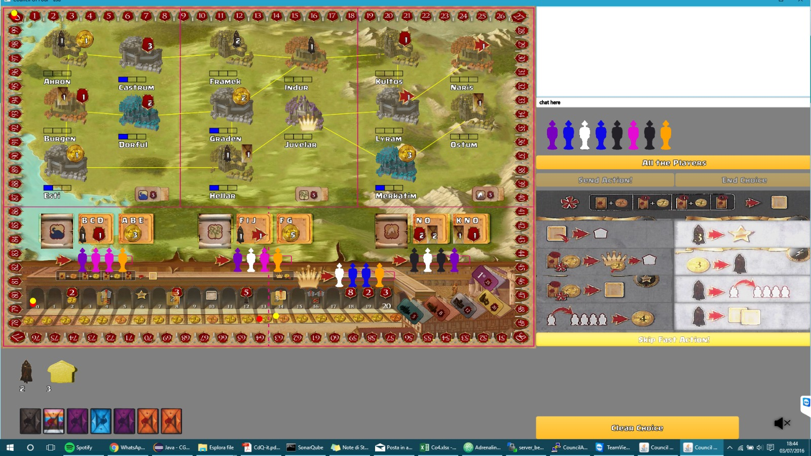

# Software Engineering Project
The repository contains the project did for the Software Engineering Course at @Polimi (Politecnico di Milano - EIT Data Science Master Programme)

## The Team

The team was composed by Filippo Pedrazzini, Paolo Polimeno and Marco Santomo.

## Description

The objective of the course was to develop a Table Game with different features, such as: Online MultiPlayer, Gui ecc. The programming language we used was Java. 

## The Council of Four

The game is really complex and with many rules. If you want more informations about the game visit this link [[COF](https://boardgamegeek.com/boardgame/173101/council-4 "COF")]

Below you find some screenshots. The GUI has been built using Java.

